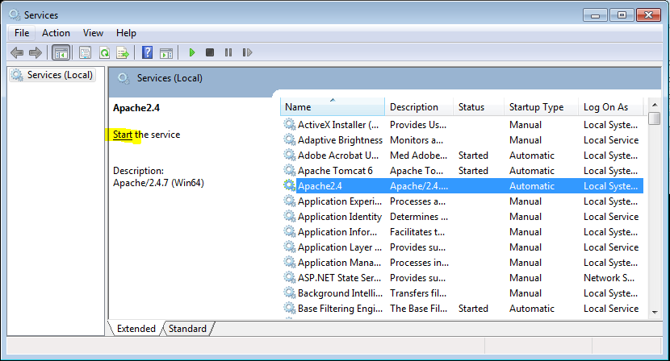
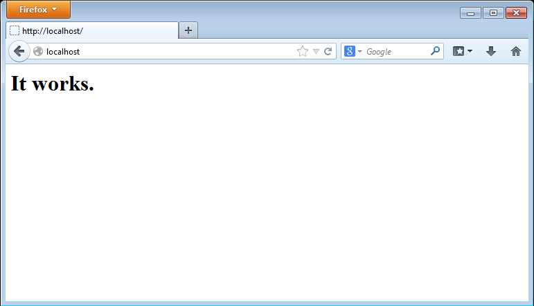
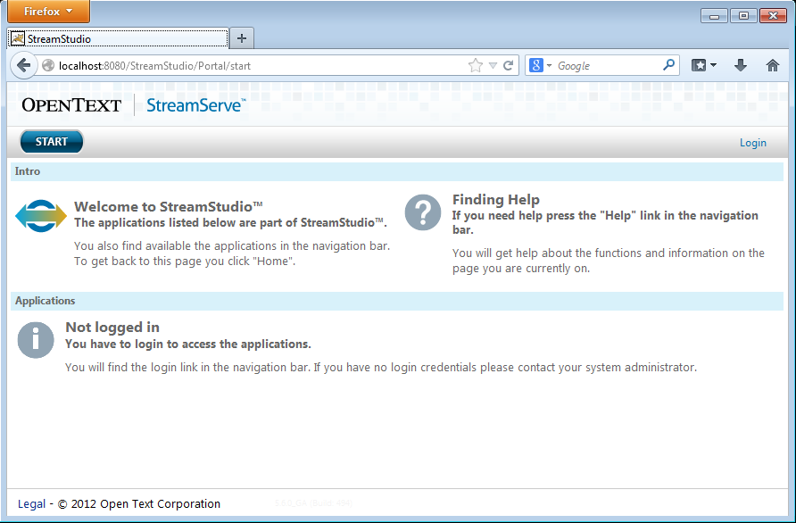

# Have HTTPd and Tomcat work together

 **Why bother install Apache HTTPd when Apache Tomcat already have a built in web server?** HTTPd is a pure web server providing additional functionality like Virtual Hosts, url rewrite, load balancing, performance advantages and more.

Follow this tutorial to install and configure Apache HTTPd to take advantage some of the above described functionalities. It’s up to you to decide if the additional functionality is worth the hassle.

## Install HTTPd

Uncompress files
```
C:\apache-httpd-tomcat>scripts\uncompess.bat
Uncompressing:
httpd-2.4.7-win64
mod_jk-1.2.37-win64
```

Move HTTPd to install directory
```
C:\apache-httpd-tomcat>move downloads\httpd-2.4.7-win64\Apache24 "\Program Files\Apache Software Foundation\HTTPd 2.4.7"
     1 dir(s) moved.
```

Configure install directory
1. open `C:\Program Files\Apache Software Foundation\HTTPd 2.4.7\conf\httpd.conf`
2. find and replace all occurences of `c:/Apache24` with `C:/Program Files/Apache Software Foundation/HTTPd 2.4.7`
3. save

Install HTTPd as a windows service
```
C:\apache-httpd-tomcat>"\Program Files\Apache Software Foundation\HTTPd 2.4.7\bin\httpd.exe" -k install
Installing the Apache2.4 service
The Apache2.4 service is successfully installed.
Testing httpd.conf....
Errors reported here must be corrected before the service can be started.
```

Start HTTPd service


Test if HTTPd is running


## Tomcat connector module

Tomcat is up running


Add Tomcat connector module
```
C:\apache-httpd-tomcat>move downloads\mod_jk-1.2.37-win64\mod_jk.so "\Program Files\Apache Software Foundation\HTTPd 2.4.7\modules"
     1 file(s) moved.
```

1. copy `C:\apache-httpd-tomcat\config\Tomcat 6.0\conf\jk\workers.properties` to `C:\Program Files\Apache Software Foundation\Tomcat 6.0\conf\jk\workers.properties` 


Enable Tomcat connector module

1. open `C:\Program Files\Apache Software Foundation\HTTPd 2.4.7\conf\httpd.conf`

```ruby
# comment
def method
  return true
end
```