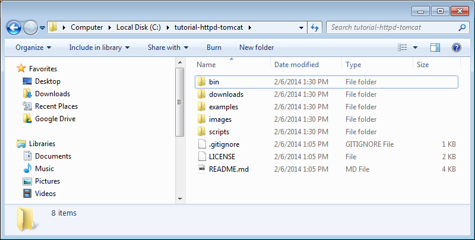
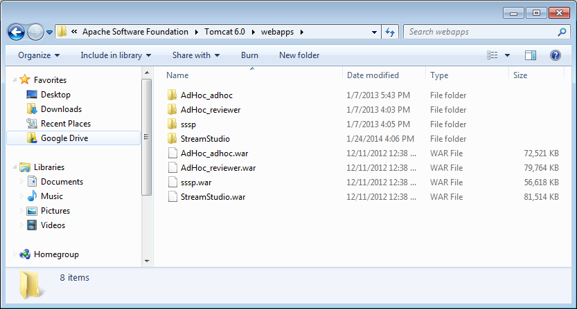
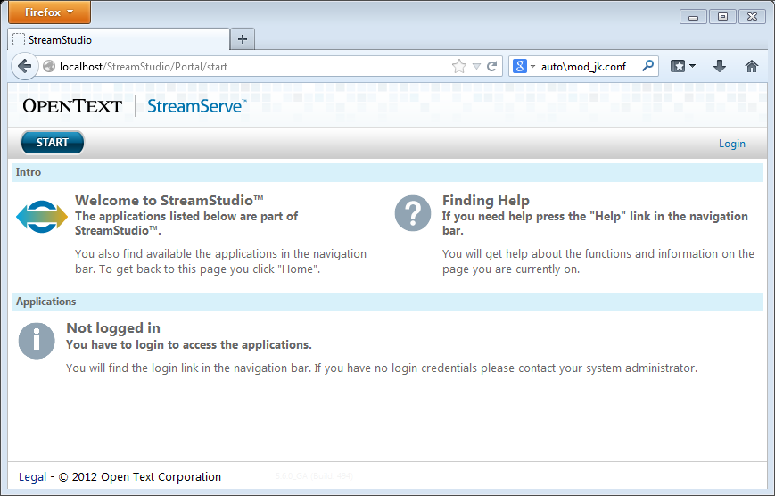

# HTTPd and Tomcat #

[TOC]

## Why bother?
**Apache Tomcat already have a built in web server, why bother install Apache HTTPd?** Tomcat bundles a generic web server to make your first .war deployemnt fast and easy. HTTPd adds functionality and performance.

* Tomcat is a application server serving .jsp files
* HTTPd is a pure web server providing additional functionality like nicer looking urls, load balancing, performance advantages, ssl and more.

**Is the additional functionality worth the extra mile?** Mabye not. Yet, some day this extra mile is worth the effort.

## Download tutorial files

This tutorial describes how to install HTTPd on Windows 7 and forward .jsp requests to Tomcat allowing you to make use of the best of two worlds.

It is assumend that Tomcat 6.0 64-bit is installed in default `C:\Program Files\Apache Software Foundation\Tomcat 6.0` directory. A differnet operating system or Tomcat version may be used if some of the file paths or distributed software are replaced in the instructions below.

Download tutorial files https://github.com/danbys/tutorial-httpd-tomcat/archive/master.zip and uncompress to `C:\tutorial-httpd-tomcat`



Uncompress distributed software
```bat
C:\tutorial-httpd-tomcat>scripts\uncompess.bat
Uncompressing:
httpd-2.4.7-win64
mod_jk-1.2.37-win64
```


## Install

### HTTPd service

Move HTTPd to install directory
```bat
C:\tutorial-httpd-tomcat>move downloads\httpd-2.4.7-win64\Apache24 \
     1 dir(s) moved.
```

Install HTTPd as a windows service
```bat
C:\tutorial-httpd-tomcat>\Apache24\bin\httpd.exe -k install
Installing the Apache2.4 service
The Apache2.4 service is successfully installed.
Testing httpd.conf....
Errors reported here must be corrected before the service can be started.
```

Start HTTPd service


Verify if HTTPd is running


Yeaay, our web server is live! What happend here? Default HTTPd configuration serves static files in `C:\Apache24\htdocs`

### Tomcat connector module

Let's have HTTPd serve .jsp requests. Verify your Tomcat site is up running


Add Tomcat connector module
```bat
C:\tutorial-httpd-tomcat>move downloads\mod_jk-1.2.37-win64\mod_jk.so Apache24\modules
     1 file(s) moved.
```

Create `%TOMCAT_HOME%\conf\jk\workers.properties`
```apache
# C:\Program Files\Apache Software Foundation\Tomcat 6.0\conf\jk\workers.properties

# Define 1 real worker using ajp13
worker.list=ajp13
# Set properties for worker1 (ajp13)
worker.worker1.type=ajp13
worker.worker1.host=localhost
worker.worker1.port=8009
```

Tomcat applications 



Enable automatic configuration by edit `%TOMCAT_HOME%\conf\server.xml`, add `Listener` element show below.
```xml
<!-- C:\Program Files\Apache Software Foundation\Tomcat 6.0\conf\server.xml -->
    <Engine name="Catalina" defaultHost="localhost">
    	<Listener className="org.apache.jk.config.ApacheConfig" modJk="C:\Apache24\modules\mod_jk.so" />
```

Every time Tomcat is restarted `%TOMCAT_HOME%\conf\auto\mod_jk.conf` is updated. Restart Tomcat, wait 2 minutes, view `mod_jk.conf`.

```apache
# C:\Program Files\Apache Software Foundation\Tomcat 6.0\conf\auto\mod_jk.conf

########## Auto generated on Thu Feb 06 14:19:08 CET 2014##########

<IfModule !mod_jk.c>
  LoadModule jk_module "C:/Apache24/modules/mod_jk.so"
</IfModule>

JkWorkersFile "C:/Program Files/Apache Software Foundation/Tomcat 6.0/conf/jk/workers.properties"
JkLogFile "C:/Program Files/Apache Software Foundation/Tomcat 6.0/logs/mod_jk.log"

JkLogLevel emerg


<VirtualHost localhost>
    ServerName localhost

    JkMount /manager ajp13
    JkMount /manager/* ajp13

    JkMount /StreamStudio ajp13
    JkMount /StreamStudio/* ajp13

    JkMount /AdHoc_reviewer ajp13
    JkMount /AdHoc_reviewer/* ajp13

    JkMount /AdHoc_adhoc ajp13
    JkMount /AdHoc_adhoc/* ajp13

    JkMount /sssp ajp13
    JkMount /sssp/* ajp13
</VirtualHost>
```

Tomcat applications manager, StreamStudio, AdHoc\_reviewer, AdHoc\_adhoc and sssp are now ready to serve HTTPd.

Add the following lines to `%HTTPD_HOME%\conf\httpd.conf`
```apache
# C:\Apache24\conf\httpd.conf

Include "C:\Program Files\Apache Software Foundation\Tomcat 6.0\conf\auto\mod_jk.conf"
```

Restart HTTPd, visit http://localhost/StreamStudio/Portal/start.



## Add custom functionality

The benefit of implementing a defualt installation is rather small. What you probably look for is the additional functionality that now can be added.

### Load Balancing

Need redundance or better load handeling?

[byrequests](http://httpd.apache.org/docs/current/mod/mod_lbmethod_byrequests.html): distribute the requests among the various workers to ensure that each gets their configured share of the number of requests.

[bybusyness](http://httpd.apache.org/docs/current/mod/mod_lbmethod_bybusyness.html): keeps track of how many requests each worker is currently assigned at present. A new request is automatically assigned to the worker with the lowest number of active requests.

[bytraffic](http://httpd.apache.org/docs/current/mod/mod_lbmethod_bytraffic.html): similar to the Request Counting method

[heartbeat](http://httpd.apache.org/docs/current/mod/mod_lbmethod_heartbeat.html): favors servers with more ready (idle) capacity over time, but does not select the server with the most ready capacity every time.

TODO: write tutorial

### HTTPS

Encrypt traffic with Secure Sockets Layer (SSL) and Transport Layer Security (TLS) protocols to protect sensitive information.

TODO: write tutorial

### Virtual Hosts

Use custom hostnames, prittify urls to simplify for the user. Serve static files more efficiantly.

TODO: write tutorial